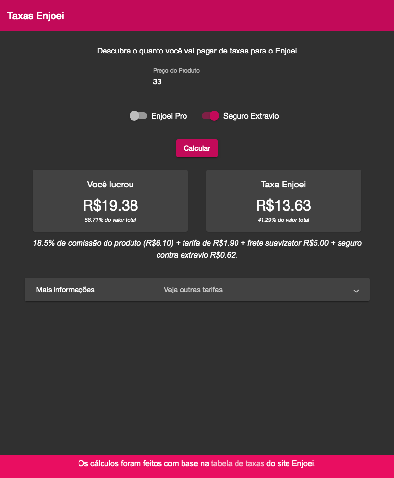

# Taxas Enjoei

Projeto feito em `Angular` com o `Material Design` para descobrir quanto de taxas será pago por item vendido no site do [Enjoei](https://www.enjoei.com.br/).  

## Captura de Tela

